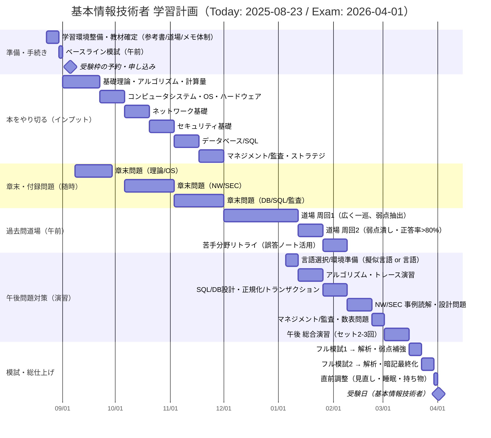

# 基本情報技術者 学習計画ガントチャート（2025-08-23 → 2026-04-01）

以下は、`fe.km`のタスクを起点に細分化した学習計画です。準備→インプット（読書+章末問題）→午前過去問→午後対策→模試・総仕上げ→直前調整の流れで、重複や並行も許容しています。

- 予約（fe.km「予約する」）：9/5までに確定。
- 本の粒度（fe.km「理論/SQL/監査」）：上記に加えてOS/ネットワーク/セキュリティ/マネジメントも明示化。
- 過去問道場（fe.km「クリアする」）：周回1→周回2→弱点潰しの3段構え。
- 午後対策（fe.km「午後問題対策する」）：アルゴリズム/DB/ネットワーク/セキュリティ/マネジメントで分割し総合演習へ。

進め方の目安
- 学習リズム：平日60–90分＋休日2–3h、週1で進捗棚卸し。
- 管理：誤答ノートとチェックリストで正答率と理解度を可視化。
- 合格ライン：午前・午後ともに正答率80%を安定して超えるまで周回。
