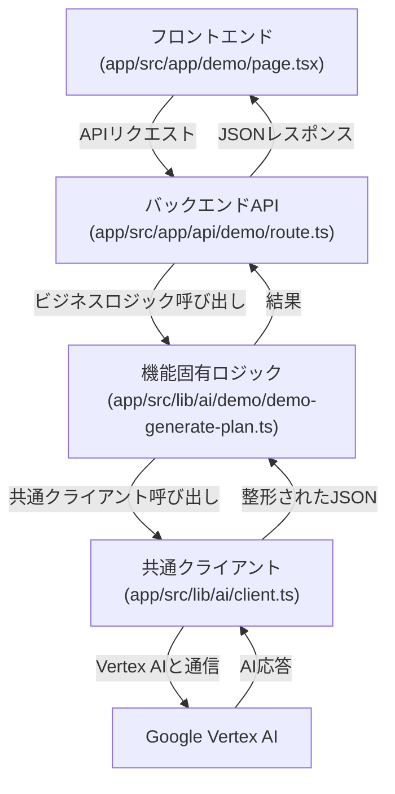

# Vertex AI 機能実装ガイド

## 1. このドキュメントの目的

このドキュメントは、`lazy-bear`プロジェクトでVertex AIを使った新機能を実装する開発者向けのガイドです。

既存の学習計画生成デモ（`app/src/app/demo`）を題材に、フロントエンドからバックエンドAPI、そしてVertex AI呼び出し共通機能までのデータフローと実装方法を解説します。このデмоをテンプレートとして利用することで、新しいAI機能を迅速に実装することを目指します。

## 2. 全体像

デモ機能は、以下の階層的なパーツで構成されています。各ファイルがそれぞれの役割に責任を持つことで、見通しが良く、拡張しやすい構造になっています。

### ファイル構成

主要なファイルは以下の場所に配置されています。

```
app/src/
├── app/
│   ├── demo/
│   │   └── page.tsx    (フロントエンド)
│   │
│   └── api/
│       └── demo/
│           └── route.ts  (バックエンドAPI)
│
└── lib/
    ├── ai/
    │   ├── demo/
    │   │   └── demo-generate-plan.ts (機能固有ロジック)
    │   │
    │   └── client.ts     (共通クライアント)
    │
    └── types.ts        (共通の型定義)
```

### 処理フロー



### 各ファイルの役割

| コンポーネント | ファイル | 役割 |
| :--- | :--- | :--- |
| **フロントエンド** | `app/src/app/demo/page.tsx` | ユーザー操作の受付、APIへのリクエスト送信、結果の表示。 |
| **バックエンドAPI** | `app/src/app/api/demo/route.ts` | HTTPリクエストの受付と応答。機能固有ロジックの呼び出し。 |
| **機能固有ロジック** | `app/src/lib/ai/demo/demo-generate-plan.ts` | AIへの具体的な指示（プロンプト、JSONスキーマ）の定義。ビジネスロジックの中心。 |
| **共通クライアント** | `app/src/lib/ai/client.ts` | Vertex AIとの通信という技術的な処理を完全に隠蔽・共通化する。 |

## 3. 実装の流れ

### ステップ1: フロントエンド (`app/src/app/demo/page.tsx`)

ユーザーが直接操作する画面です。

- **役割:** ユーザー入力を受け取り、バックエンドAPI (`api/demo`) へ`fetch`でリクエストを送信し、返ってきた結果を表示します。

- **コードのポイント:**
  ```tsx
  // ...
  const res = await fetch('api/demo', { /* ... */ });
  const data = await res.json();
  setResponse(data);
  // ...
  ```

### ステップ2: バックエンドAPI (`app/src/app/api/demo/route.ts`)

フロントエンドとAIロジックを繋ぐ中継役です。

- **役割:** HTTPリクエストを受け付け、`app/src/lib/ai/demo/demo-generate-plan.ts`に定義されたビジネスロジックを呼び出し、その結果をJSONとしてフロントエンドに返します。

- **コードのポイント:**
  ```typescript
  import { generateLearningPlan } from '@/lib/ai/demo/demo-generate-plan';

  export async function POST(request: Request) {
    // ...リクエストからデータを取り出す...
    const plan = await generateLearningPlan(qualificationName, deadline);
    return NextResponse.json(plan);
  }
  ```

### ステップ3: AI呼び出しロジック

Vertex AIとの通信部分は、**「機能固有ロジック」** と **「共通クライアント」** の2層に分かれています。

#### 3.1 機能固有ロジック (`app/src/lib/ai/demo/demo-generate-plan.ts`)

この機能の「何をさせたいか」を定義する、ビジネスロジックの中心です。

- **役割:**
  - AIへの具体的な指示（システムプロンプト）を定義する。
  - AIに生成させたいJSONの構造（スキーマ）を定義する。
  - 上記2つとユーザーからの入力を、後述の「共通クライアント」に渡して、AIからの応答を得る。

- **コードのポイント:**
  ```typescript
  import { generateContentFromPrompt } from '../client';
  import { LearningPlan } from '@/lib/types';

  const systemInstruction = 'あなたは優秀な学習プランナーです...';
  const learningPlanSchema: FunctionDeclarationSchema = { /* ... */ };

  export async function generateLearningPlan(...) {
    // この機能特有のプロンプトやスキーマを共通クライアントに渡す
    return await generateContentFromPrompt<LearningPlan>(
      systemInstruction,
      userPrompt,
      learningPlanSchema
    );
  }
  ```

#### 3.2 共通クライアント (`app/src/lib/ai/client.ts`)

Vertex AIとの通信という、技術的で面倒な処理をすべて引き受ける部品です。

- **役割:**
  - どんなプロンプトやスキーマが来ても、Vertex AIと正しく通信し、結果を返すことだけに責任を持つ。
  - AIに特定のJSON形式で応答させる`tools`機能の複雑な部分をカプセル化（隠蔽）する。

- **ポイント:**
  - **新しいAI機能を追加する際、このファイルを修正する必要は基本的にありません。**
  - `generateContentFromPrompt`関数は、どんな機能からでも呼び出せるように汎用的に作られています。

## 4. 新しいAI機能の実装方法 (チュートリアル)

この階層構造を理解すると、新しい機能の追加は非常に簡単です。

1.  **型の定義:** `app/src/lib/types.ts`に新しい機能用の型を追加する。
2.  **機能固有ロジックの作成:** `app/src/lib/ai/demo`を参考に、新しい機能用の`my-feature`ディレクトリと`my-feature-generate-plan.ts`のようなファイルを作成し、プロンプトとスキーマを記述する。
3.  **バックエンドAPIの作成:** `app/src/app/api/demo`を参考に、新しいAPIルート`app/src/app/api/my-feature`を作成し、手順2の関数を呼び出す。
4.  **フロントエンドの作成:** `app/src/app/demo`を参考に、新しいページ`app/src/app/my-feature`を作成し、手順3のAPIを呼び出す。