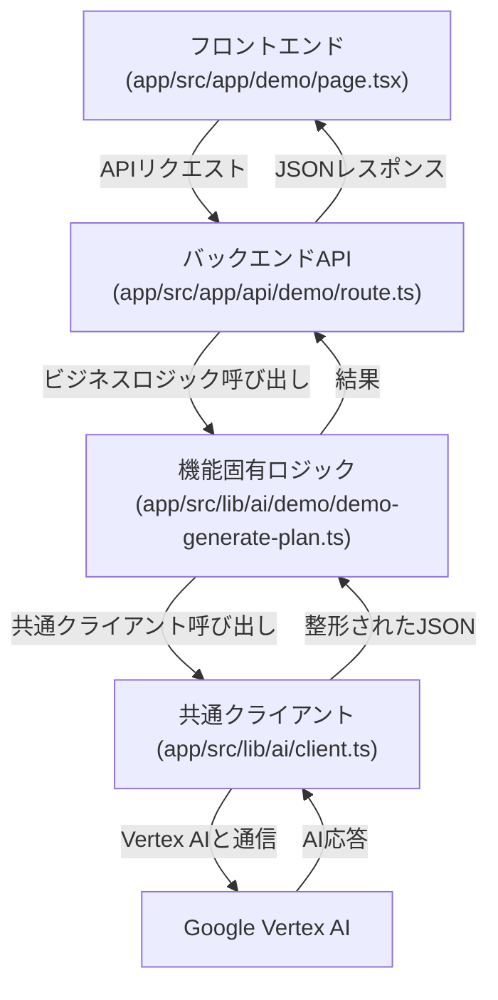

# Vertex AI 機能実装ガイド

## 1. このドキュメントの目的

このドキュメントは、`lazy-bear`プロジェクトでVertex AIを使った新機能を実装する開発者向けのガイドです。

学習計画生成デモ（`app/src/app/demo`）を題材に、フロントエンドからバックエンドAPI、そしてVertex AI呼び出し共通機能までのデータフローと実装方法を解説します。このデモをテンプレートとして利用することで、新しいAI機能を迅速に実装することを目指します。

## 2. 全体像

デモ機能は、以下の階層的なパーツで構成されています。各ファイルがそれぞれの役割に責任を持つことで、見通しが良く、拡張しやすい構造になることを意図しています。

### ファイル構成

主要なファイルは以下の場所に配置されています。

```
app/src/
├── app/
│   ├── demo/
│   │   └── page.tsx    (フロントエンド)
│   │
│   └── api/
│       └── demo/
│           └── route.ts  (バックエンドAPI)
│
└── lib/
    ├── ai/
    │   ├── demo/
    │   │   └── demo-generate-plan.ts (機能固有ロジック)
    │   │
    │   └── client.ts     (共通クライアント)
    │
    └── types.ts        (共通の型定義)
```

### 処理フロー



### 各ファイルの役割

| コンポーネント | ファイル | 役割 |
| :--- | :--- | :--- |
| **フロントエンド** | `app/src/app/demo/page.tsx` | ユーザー操作の受付、APIへのリクエスト送信、結果の表示。 |
| **バックエンドAPI** | `app/src/app/api/demo/route.ts` | HTTPリクエストの受付と応答。機能固有ロジックの呼び出し。 |
| **機能固有ロジック** | `app/src/lib/ai/demo/demo-generate-plan.ts` | AIへの具体的な指示（プロンプト、JSONスキーマ）の定義。ビジネスロジックの中心。 |
| **共通クライアント** | `app/src/lib/ai/client.ts` | Vertex AIとの通信という技術的な処理を完全に隠蔽・共通化する(基本的に、機能追加時に修正する必要はありません)。 |

## 3. 実装の流れ

### ステップ1: フロントエンド (`app/src/app/demo/page.tsx`)

ユーザーが直接操作する画面です。このデモでは、ユーザーからの入力である`qualificationName(資格名)`と`deadline（期日）`を受け取り、バックエンドAPIへリクエストを送信します。

```typescript
// ...
  const handleSubmit = async (e: React.FormEvent) => {
    // ... (ローディング開始などのUI制御)
    try {
      // --- フロントエンド → バックエンド ---
      // fetch APIを使い、バックエンドAPI(/api/demo)にPOSTリクエストを送信します。
      const res = await fetch('api/demo', {
        method: 'POST',
        headers: { 'Content-Type': 'application/json' },
        // ユーザーが入力した「資格名」「期日」をJSONで送信
        body: JSON.stringify({
          qualificationName: qualificationName,
          deadline: deadline,
        }),
      });

      // ... (エラーチェック)

      // --- バックエンド → フロントエンド ---
      // 結果をJSONで受け取り、画面表示用のStateに保存
      const data = await res.json();
      setResponse(data);

    } catch (err) {
      // ... (エラー表示処理)
    }
  };
// ...
```

### ステップ2: バックエンドAPI (`app/src/app/api/demo/route.ts`)

フロントエンドとAIロジックを繋ぐ中継役です。

```typescript
// ...
export async function POST(request: Request) {
  try {
    // --- フロントエンド → バックエンド ---
    // リクエストボディからJSONを取り出す
    const body = await request.json();
    const {
      qualificationName, // 資格名
      deadline,          // 期日
    } = body;

    // ... (入力値チェック)

    // --- バックエンド → AIロジック ---
    // 取り出したデータを引数に、AIロジック関数を呼び出す
    const plan = await generateLearningPlan(qualificationName, deadline);

    // --- AIロジック → フロントエンド ---
    // 結果をJSONでフロントエンドに返す
    return NextResponse.json(plan);

  } catch (error) {
    // ... (サーバーエラー処理)
  }
}
```

### ステップ3: AI呼び出しロジック

Vertex AIとの通信部分は、**「機能固有ロジック」** と **「共通クライアント」** の2層に分かれています。

#### 3.1 機能固有ロジック (`app/src/lib/ai/demo/demo-generate-plan.ts`)

AIに「何をさせたいか」を定義する、機能の心臓部です。

```typescript
import { generateContentFromPrompt } from '../client';
import { FunctionDeclarationSchema } from '@google-cloud/vertexai';
import { LearningPlan } from '@/lib/types';

// 1. AIの役割・前提条件を定義 (システムプロンプト)
const systemInstruction = 'あなたは優秀な学習プランナーです。ユーザーが指定した資格と期限に基づき、現実的で詳細な学習計画をステップとタスクの形式で生成してください。';

// 2. AIの応答形式をJSONスキーマで固定
// `types.ts`のLearningPlan型に対応するスキーマを定義します。
// (詳細な定義はソースコードを参照してください)
const learningPlanSchema: FunctionDeclarationSchema = { /* ... */ };

// 3. ユーザーからの具体的な要求を組み立て、AIに送信
export async function generateLearningPlan(
  qualificationName: string, // 資格名
  deadline: string           // 期日
): Promise<LearningPlan> {
  // ユーザーの入力を埋め込んだプロンプトを作成します。
  const userPrompt = `
    資格名: ${qualificationName}
    合格期限: ${deadline}

    上記の資格に合格するための学習計画を生成してください。
  `;

  // 「役割」「応答形式」「要求」の３つを共通クライアントに渡します。
  return await generateContentFromPrompt<LearningPlan>(
    systemInstruction,
    userPrompt,
    learningPlanSchema
  );
}
```

#### 3.2 共通クライアント (`app/src/lib/ai/client.ts`)

Vertex AIとの通信という技術的な処理を引き受ける部品です。（機能追加時にこのファイルを修正する必要は基本的にありません。）

このファイルの中心となる`generateContentFromPrompt`関数は、「機能固有ロジック」で定義された以下の3つの要素を引数として受け取ります。
- **`systemInstruction`**: AIへの役割指示
- **`userPrompt`**: ユーザーからの具体的な要求
- **`responseSchema`**: AIに強制するJSONスキーマ

```typescript
import { VertexAI, FunctionDeclarationSchema, GenerateContentRequest } from '@google-cloud/vertexai';

// ... (VertexAIクライアントの初期化処理) ...

export const generateContentFromPrompt = async <T>(
  systemInstruction: string,
  userPrompt: string,
  responseSchema?: FunctionDeclarationSchema
): Promise<T> => {
  // 機能固有ロジックから渡された指示でモデルを取得
  const generativeModel = getGenerativeModel(systemInstruction);

  // Vertex AIへのリクエストオブジェクトを作成
  const request: GenerateContentRequest = {
    contents: [
      { role: 'user', parts: [{ text: userPrompt }] },
    ],
  };

  // スキーマが指定されていれば、AIの応答形式をJSONに固定する設定を追加
  if (responseSchema) {
    request.tools = [
      {
        functionDeclarations: [
          {
            name: 'json_output',
            description: 'Formats the output as a JSON object based on the provided schema.',
            parameters: responseSchema,
          },
        ],
      },
    ];
    request.generationConfig = {
      responseMimeType: 'application/json',
    };
  }

  try {
    // Vertex AIにリクエストを送信
    const resp = await generativeModel.generateContent(request);
    // レスポンスからAIが生成した関数呼び出し(JSONデータ)部分を取得
    const functionCall = resp.response.candidates?.[0]?.content?.parts?.[0]?.functionCall;

    if (functionCall?.args) {
      // データを指定されたTypeScriptの型<T>に変換して返す
      return functionCall.args as T;
    }

    // ... (functionCallが使えなかった場合のフォールバック処理) ...
    throw new Error('Vertex AIからの有効な応答がありませんでした。');

  } catch (error) {
    console.error('Vertex AIの呼び出し中にエラーが発生しました:', error);
    throw new Error('コンテンツの生成に失敗しました。');
  }
};
```

## 4. 新しいAI機能の実装方法 (チュートリアル)

この階層構造を理解すると、新しい機能の追加は非常に簡単です。

1.  **型の定義:** `app/src/lib/types.ts`に新しい機能用の型を追加する。
2.  **機能固有ロジックの作成:** `app/src/lib/ai/demo`を参考に、新しい機能用の`my-feature`ディレクトリと`my-feature-generate-plan.ts`のようなファイルを作成し、プロンプトとスキーマを記述する。
3.  **バックエンドAPIの作成:** `app/src/app/api/demo`を参考に、新しいAPIルート`app/src/app/api/my-feature`を作成し、手順2の関数を呼び出す。
4.  **フロントエンドの作成:** `app/src/app/demo`を参考に、新しいページ`app/src/app/my-feature`を作成し、手順3のAPIを呼び出す。
