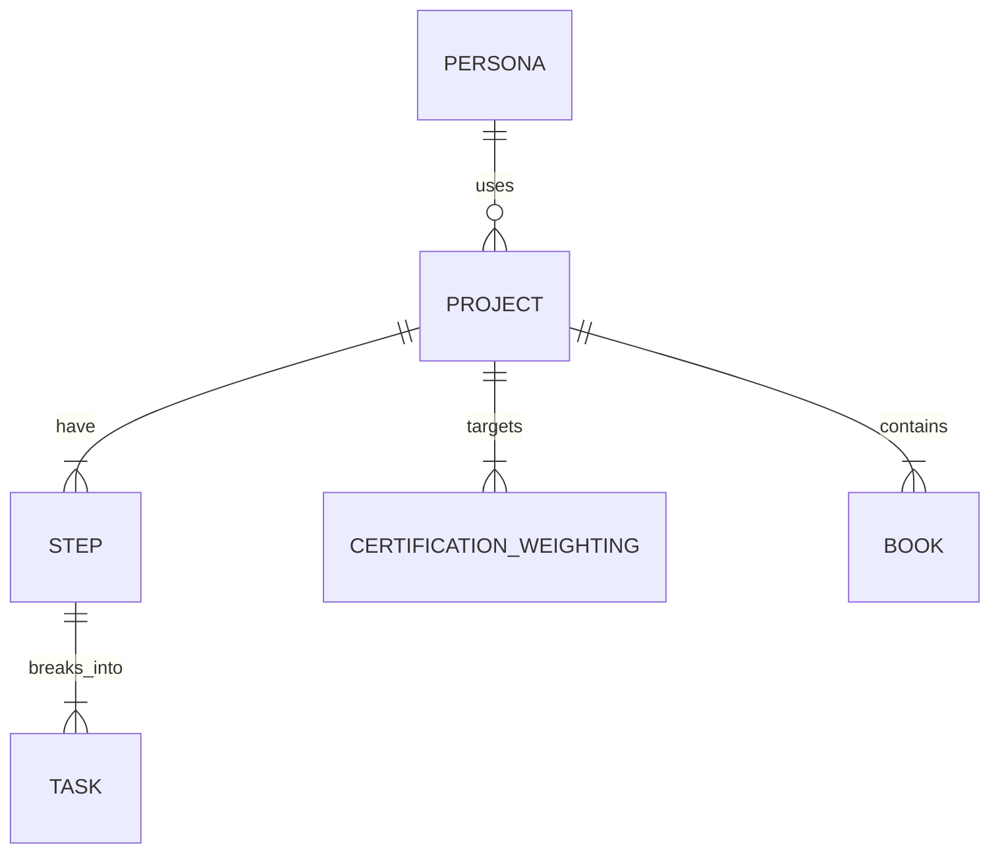

# lazy-bear プロジェクト計画書

## 1. プロジェクト概要
- 目的: 資格取得に向けた学習計画（ステップ/タスク）を生成AIで自動生成し、ガントチャートで見える化する。
- 期間: 2025/08/23 〜 2025/09/21（初学者ハッカソン）
- 発表: 2025/09/21 デモ発表
- メンバー: はよちゃん / 山口 さん / いぐっちゃん
- ドキュメント言語: 日本語

## 2. 背景・目的
- As-Is（困りごと）
  - 資格取得までにどんなステップを踏めばよいか分からない。
  - 本/Udemy/YouTubeなど教材の章をどのくらいの期間で進めればよいか分からない。
  - どのタスクをいつまでに実施すべきかを一目で把握したい。
- To-Be（実現したいこと）
  - 生成AIが資格取得までのステップと具体タスク＋期日を自動生成し、ガントチャートで提示。
  - スケジュール遅延が発生した際、生成AIが状況を理解し再スケジューリング（将来的対応）。
  - 追加機能（将来）: 教材（本/Udemy/YouTube）の項目をAPIで取得し、内容理解の上でタスクを自動生成。

## 3. スコープ
- スコープ内（ハッカソン期間／MVP）
  - 資格名や期限などの入力。
  - Vertex AIを用いた「ステップ」と「タスク」の自動生成。
  - 生成結果のガントチャート表示。
  - 資格情報（試験分野・点数配分）のAI取得と手動編集。
- スコープ内（後回し）
  - 教材情報（本/Udemy/YouTube）の項目取得APIの実装（著作権懸念のため後回し）。
- スコープ外
  - 「ステップ」「タスク」の詳細な編集機能一式（順序変更や削除含む）。

  - ユーザーテーブルとログイン機能（実装要否は検討中、MVPでは未実装前提）。

## 4. 成果物
- アプリケーション（Next.jsベース）
  - 入力フォーム（資格名/勉強会日/期限など）。
  - AI生成されたステップ/タスクの一覧とガントチャート表示。
  - （任意）資格情報の手動編集UIの最小実装。
- ドキュメント
  - この計画書、要件/画面フロー、データ設計概要。
  - Jira上のスプリント/チケット（管理計画）。

## 5. 体制・コミュニケーション
- 主な連絡: Discord（必要に応じてLINE）
- スケジュール/課題管理: Jira
- MTG頻度: 随時設定（進捗/課題ベース）

## 6. マイルストーン
- 8/23: チーム作成・企画（完了）
- 8/24-8/31: MVP要件確定・デザイン/データ設計・API設計
- 9/1-9/15: 実装（AI連携/ガント表示/入力フォーム）
- 9/15-9/18: 動作確認・改善・デモシナリオ作成
- 9/19-9/20: 仕上げ（微修正・デモ準備）
- 9/21: 発表・デモ

## 7. 要件定義
### 7.1 機能要件（MVP）
- 資格情報入力:
  - 受験する試験名、勉強会日、期限の入力。
- 資格情報取得/編集:
  - Vertex AIが試験分野や点数配分を取得（自動案）。
  - ユーザーが必要に応じて手動修正。
- 学習計画生成:
  - Vertex AIが合格までの「ステップ」を提案。
  - ユーザーが必要に応じてステップを手動修正。
  - 各ステップに紐づく具体的「タスク」（開始/終了日）を生成。
- 表示:
  - ステップ/タスクをガントチャートで表示。
- 保存:
  - プロジェクト/ステップ/タスク/点数配分をDBへ保存。

### 7.2 機能要件（将来/ストレッチ）
- ステップ/タスクの詳細編集（追加・削除・順序変更）。
- 進捗管理（タスクの完了/遅延ステータス）と自動再スケジュール。
- 教材の選択/紐付け（書籍/Udemy/YouTube、複数選択可）。
- 教材項目のAPI取得と内容理解に基づくタスク生成。
- ユーザー認証/ログインと個人プロジェクト管理。

### 7.3 非機能要件（MVP）
- パフォーマンス: ガント表示/一覧操作が快適に動作。
- 可用性: デモで安定稼働（最低限のエラーハンドリング）。
- 保守性: 型安全（TypeScript）、軽量ORM（Drizzle）で実装。
- 拡張性: 後日のモバイル展開を見据えREST APIで分離可能に。

## 8. 画面/フロー（MVP想定）
1) （ログイン: 検討中／MVPではスキップ）
2) 資格名入力画面
   - 試験名・勉強会日・期限を入力。
3) （教材選択: 将来対応、複数選択可/種類は書籍・Udemy・YouTube）
4) 資格情報取得/編集
   - Vertex AIが試験分野/点数配分を提案、ユーザーが修正可能。
5) ステップ提案＆（将来）修正
   - Vertex AIがステップ案を提示。
6) タスク生成＆ガント表示
   - ステップに紐づく具体タスクを生成し、ガントチャートで可視化。

## 9. データ設計（概要）
- テーブル候補
  - ペルソナ（将来）
  - プロジェクト
  - 点数配分（プロジェクトIDを外部キーにもつ）
  - ステップ（0..1 件の教材と紐付く前提）
  - タスク（内容/開始日/終了日/将来: ステータス）
  - 教材（将来: 種別=書籍/Udemy/YouTube、章立て）
- 関係の要点
  - プロジェクト 1 - N ステップ
  - ステップ 1 - N タスク
  - プロジェクト 1 - N 点数配分（または分野別スコア定義）
  - ステップ 0..1 - 1 教材（ステップあたり最大1教材）

### ER図（リレーションのみ）

## 10. システム構成
- フロント/バック: Next.js（App Router, TypeScript）
- データアクセス: Drizzle（RDB）
- AI: Vertex AI 連携
- API: 同一プロジェクト内実装だが、将来拡張を見据えREST APIで疎結合化
- データベース: RDB（教材/タスクもRDBで問題ない見込み。必要なら一部NoSQLを検討）

## 11. スケジュール管理
- 管理ツール: Jira

## 12. リスクと対応
- 著作権の懸念:
  - 教材項目のAPI取得は後回し。デモではダミーデータ/手入力で代替。
- AI出力の品質/一貫性:
  - プロンプト設計とバリデーションロジックを用意。手動修正UIを最小で確保。
- スケジュール遅延:
  - Jiraで進捗可視化。将来的に自動再スケジュール機能を提供。
- ログイン未決定:
  - MVPでは匿名/ローカル保存で対応し、リリース前に方針決定。

## 13. 用語定義
- プロジェクト: どの資格をいつまでに取得するか等、スケジュールを作成する最大単位。
- ステップ: プロジェクト成功のためのマイルストーン相当。WBS上位の作業単位。
- タスク: ステップ配下の具体作業。内容/開始日/終了日（将来: 進捗ステータス）。
- 教材: プロジェクト達成に使用する教材（書籍/YouTube/Udemy）。プロジェクト内で複数選択可。ステップには0または1件が紐づく。教材が結びつくステップのタスク作成は章立てを参照。

## 14. 実装方針（MVP）
- 画面
  - 入力フォーム（試験名/日付/期限）→ AI呼び出し → 結果確認 → ガント表示。
- サービス
  - AIサービス: Vertex AIクライアント＋プロンプト定義（資格分野/点数配分/ステップ/タスク生成）。
  - 計画サービス: ステップ/タスクの正規化・日付整合チェック。
- データ
  - Drizzleでスキーマ定義。プロジェクト/ステップ/タスク/点数配分の最小セットを実装。

## 15. 受け入れ基準（MVP）
- 試験名/期限を入力し、AIがステップとタスクを生成できる。
- 生成結果がDBに保存され、ガントチャートで表示できる。
- 最低限の手動編集（点数配分の修正など）が可能、またはデモ上問題ない代替を用意。
- 主要フローがエラーなくデモできる（オフライン/ダミーデータの準備）。

---
補足/更新履歴
- スコープ: 「ステップ/タスクの生成」までを優先。編集機能は後回し。
- 教材API: 著作権配慮のため後回し（必要ならダミー投入）。
- ログイン: 実装要否は検討中（MVPでは未実装前提）。
