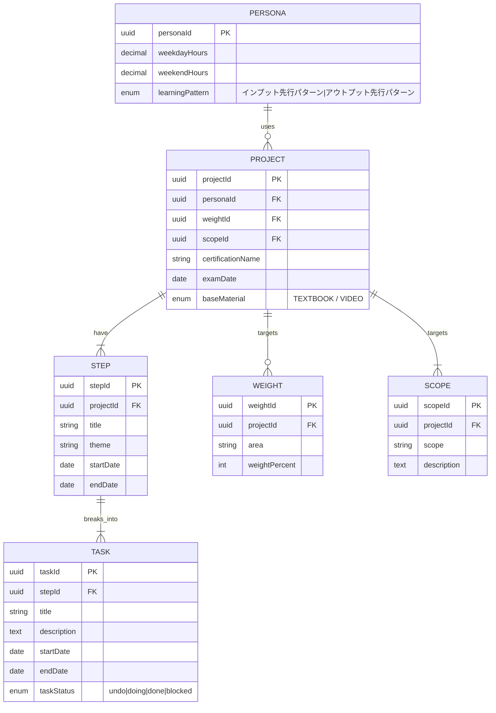

## ER図 (書籍テーブルはスキップ)

```mermaid
erDiagram
    PROJECT ||--|{ STEP : have
    STEP ||--|{ TASK : breaks_into
    PERSONA ||--o{ PROJECT : uses
    PROJECT ||--o{ WEIGHT : targets
    PROJECT ||--|{ SCOPE : targets

    PROJECT {
        uuid projectId PK
        uuid personaId FK
        uuid weightId FK
        uuid scopeId FK
        string certificationName
        date examDate
        enum baseMaterial "TEXTBOOK / VIDEO"
    }

    STEP {
        uuid stepId PK
        uuid projectId FK
        string title
        string theme
        date startDate
        date endDate
    }

    TASK {
        uuid taskId PK
        uuid stepId FK
        string title
        text description
        date startDate
        date endDate
        enum taskStatus "undo|doing|done|blocked"
    }

    PERSONA {
        uuid personaId PK
        decimal weekdayHours
        decimal weekendHours
        enum learningPattern "インプット先行パターン|アウトプット先行パターン"
    }

    WEIGHT {
        uuid weightId PK
        uuid projectId FK
        string area
        int weightPercent
    }

    SCOPE {
        uuid scopeId PK
        uuid projectId FK
        string scope
        text description
    }
```