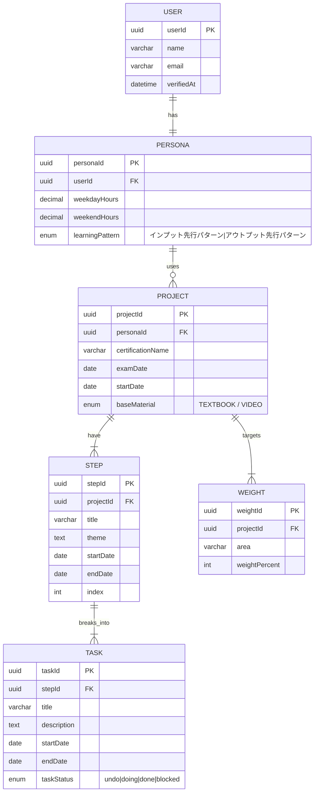

## ER図

```mermaid
erDiagram
    PROJECT ||--|{ STEP : have
    STEP ||--|{ TASK : breaks_into
    PERSONA ||--o{ PROJECT : uses
    USER ||--|| PERSONA : has
    PROJECT ||--|{ WEIGHT : targets

    USER {
        uuid userId PK
        varchar name
        varchar email
        datetime verifiedAt
    }

    PERSONA {
        uuid personaId PK
        uuid userId FK
        decimal weekdayHours
        decimal weekendHours
        enum learningPattern "インプット先行パターン|アウトプット先行パターン"
    }

    PROJECT {
        uuid projectId PK
        uuid personaId FK
        varchar certificationName
        date examDate
        date startDate
        enum baseMaterial "TEXTBOOK / VIDEO"
    }

    STEP {
        uuid stepId PK
        uuid projectId FK
        varchar title
        text theme
        date startDate
        date endDate
        int index
    }

    TASK {
        uuid taskId PK
        uuid stepId FK
        varchar title
        text description
        date startDate
        date endDate
        enum taskStatus "undo|doing|done|blocked"
    }

    WEIGHT {
        uuid weightId PK
        uuid projectId FK
        varchar area
        int weightPercent
    }
```