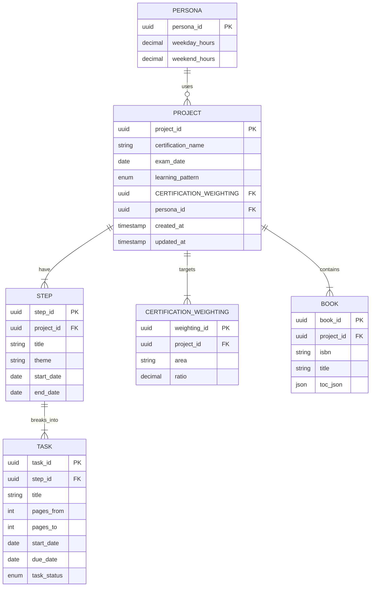

## ER図 (書籍テーブルはスキップ)

```mermaid
erDiagram
  PROJECT ||--|{ STEP : have
  STEP ||--|{ TASK : breaks_into

  PERSONA ||--o{ PROJECT : uses
  PROJECT ||--|{ CERTIFICATION_WEIGHTING : targets
  PROJECT ||--|{ BOOK : contains

  PROJECT {
    uuid project_id PK
    string certification_name
    date exam_date
    enum learning_pattern
    %% "インプット先行パターン|アウトプット先行パターン（2レコード想定）"
    uuid CERTIFICATION_WEIGHTING FK
    uuid persona_id FK
    timestamp created_at
    timestamp updated_at
  }

  STEP {
    uuid step_id PK
    uuid project_id FK
    string title
    string theme
    date start_date
    date end_date
  }

  TASK {
    uuid task_id PK
    uuid step_id FK
    string title
    int    pages_from
    int    pages_to
    date   start_date
    date   due_date
    enum   task_status
    %% "undo|doing|done|blocked（4レコード想定）"
  }

  PERSONA {
    uuid persona_id PK
    decimal weekday_hours
    decimal weekend_hours
  }

  BOOK {
    uuid book_id PK
    uuid project_id FK
    string isbn
    string title
    json   toc_json
  }

  CERTIFICATION_WEIGHTING {
    uuid weighting_id PK
    uuid project_id FK
    string area
    decimal ratio
  }
```